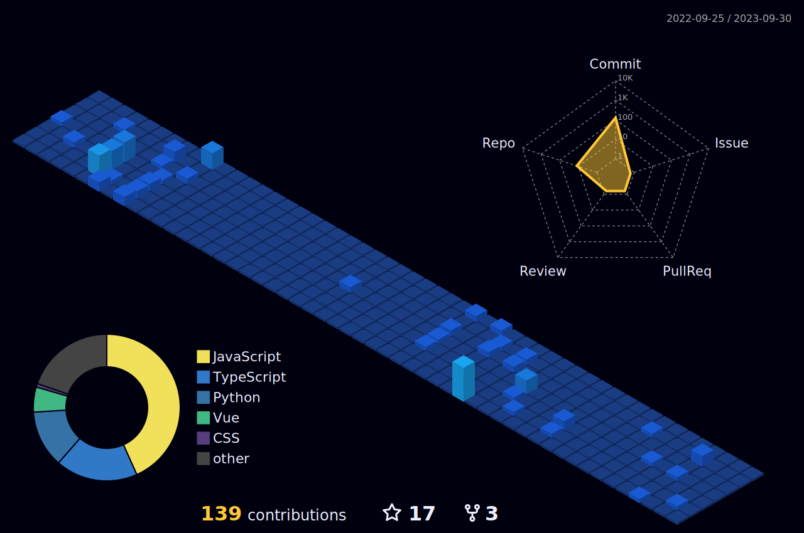

<h1 align="left">Hi, I'm Forest 👋</h1>
<h3 align="left">I'm a front-end coder.</h3>

- 🌱 &nbsp;&nbsp; I’m currently learning `React(include Next.js)` `Nest.js` `Go`
- 👨‍💻 &nbsp;&nbsp; All of my projects are available at [repositories](https://github.com/forest-211?tab=repositories)
- 📫 &nbsp;&nbsp; How to reach me **<767425412lin@gmail.com>**

 <em style="width: 2em"></em>
 

    

