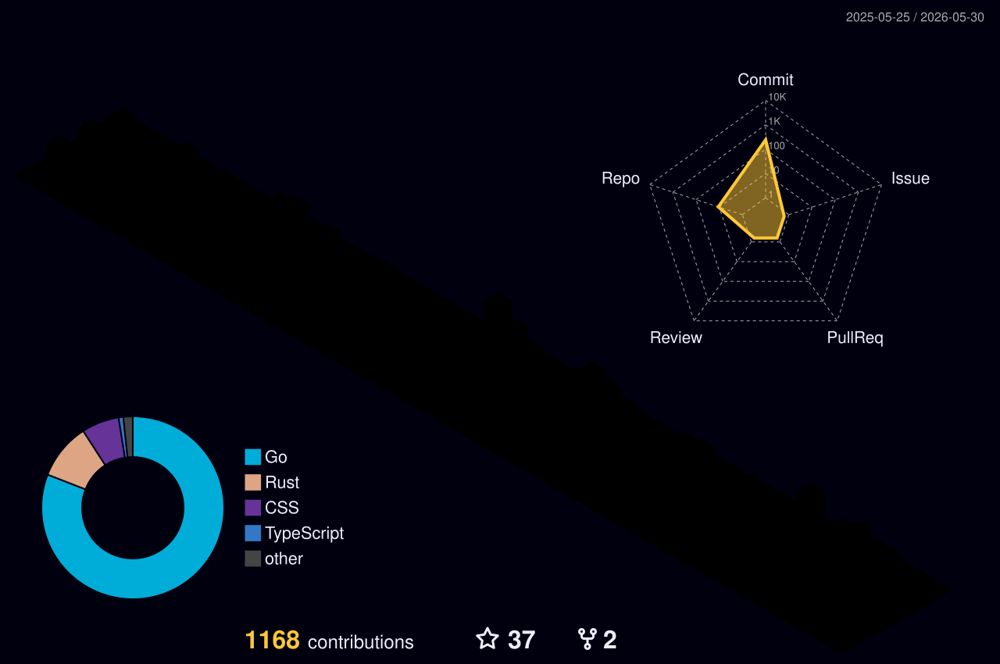

<h1 align="left">Hi, I'm Forest 👋</h1>
<h3 align="left">AI Native Full-Stack Engineer · Rust · Go · AI</h3>

* 🤖    Focused on building **AI-powered products and intelligent systems**, exploring the future of software development in the AI era.
* 🦀    Currently diving deep into **Rust**, especially `Axum`, high-performance backend engineering, and the **Rust + AI** ecosystem.
* 🐹    Experienced with **Go** and modern web technologies, including `TypeScript`, `React`, `Vue`, and `Node.js`.
* 🧠    Exploring **LLM, AI Agents, RAG, Knowledge Bases, LLM Gateways**, and AI-native application architectures.
* 🏗️    Enjoy building end-to-end intelligent systems covering **product design, frontend & backend development, data systems, AI capabilities, engineering architecture, and infrastructure**.
* 📚    Learning through building — exploring software architecture, distributed systems, databases, and AI engineering.
* 💻    Check out my projects in [Repositories](https://github.com/clin211?tab=repositories).
* ✍️    Sharing technical explorations, engineering practices, and thoughts on AI-native development.
* 💬    Feel free to ask me about **Rust, Go, AI Engineering, LLM, RAG, AI Agents, TypeScript, and Web Development**.
* 📫    Contact me: **[767425412lin@gmail.com](mailto:767425412lin@gmail.com)**

    &nbsp&nbsp

<!--

    

-->

<!--
  

  
-->

  

