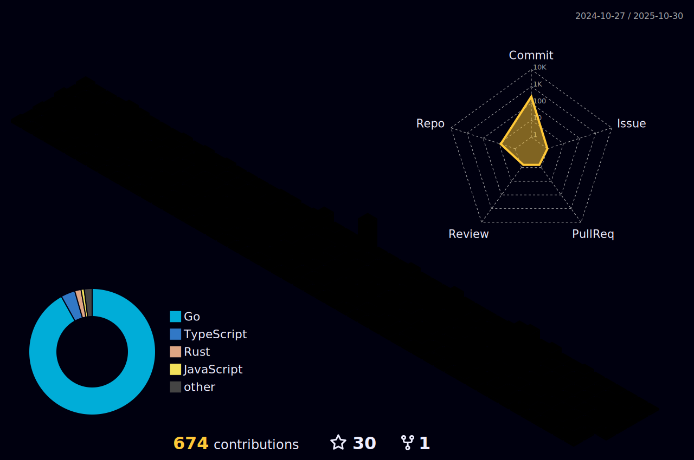

<h1 align="left">Hi, I'm Forest 👋</h1>
<h3 align="left">I'm a front-end coder.</h3>

- 🌱 &nbsp;&nbsp; I’m currently learning `Go` `MySQL` `Rust`
- 👨‍💻 &nbsp;&nbsp; All of my projects are available at [repositories](https://github.com/clin211?tab=repositories)
- 📝 I regularly write articles on [clin.pro](clin.pro)
- 💬 Ask me about **HTML,CSS,JavaScript,Node.js,TypeScript,Vue,React,Go**
- 📫 &nbsp;&nbsp; How to reach me **<767425412lin@gmail.com>**

<h3 align="left">Languages and Tools:</h3>

                             

<!--

    

-->

<!--
  

  
-->

  

